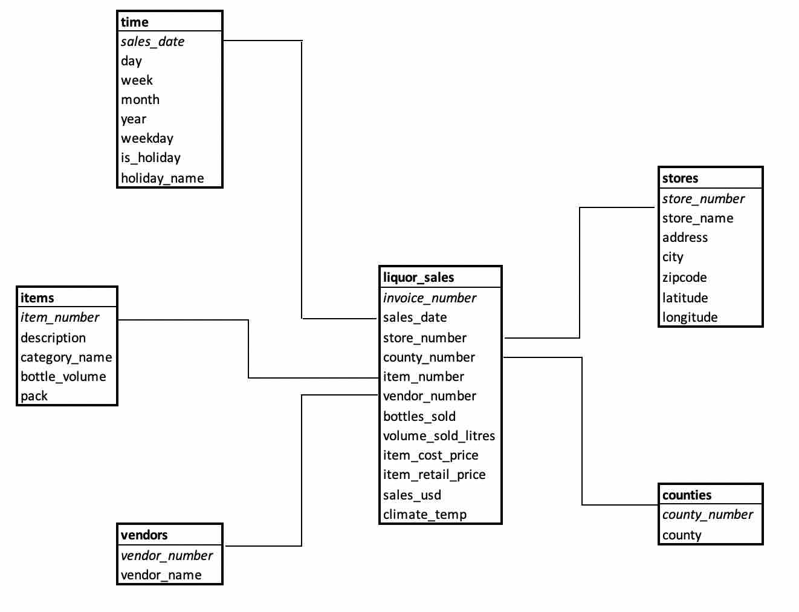
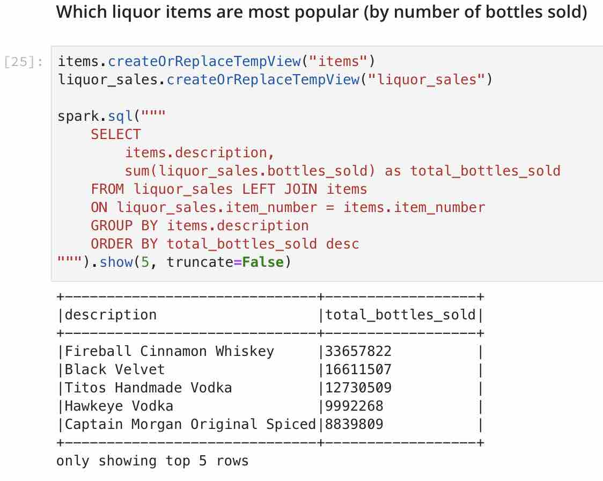
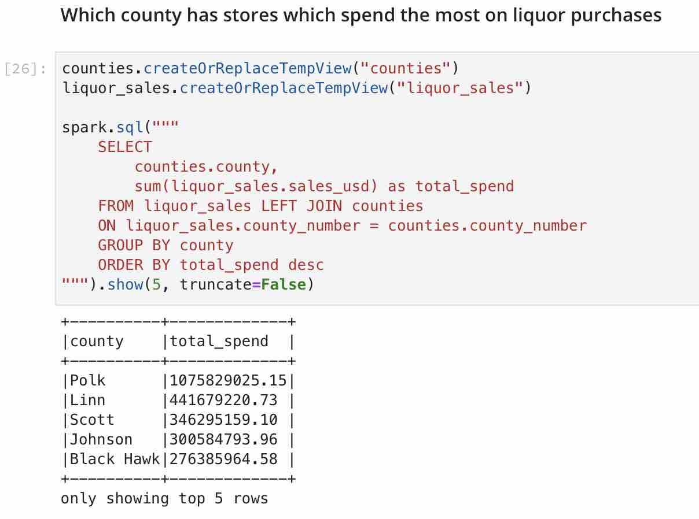
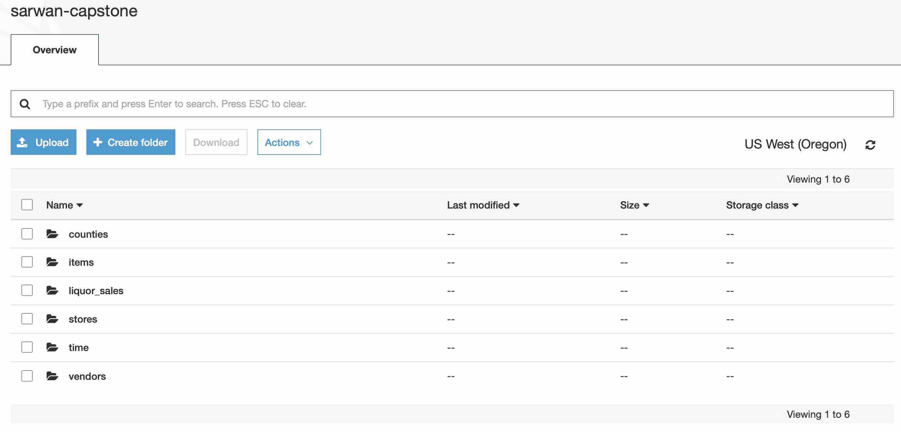
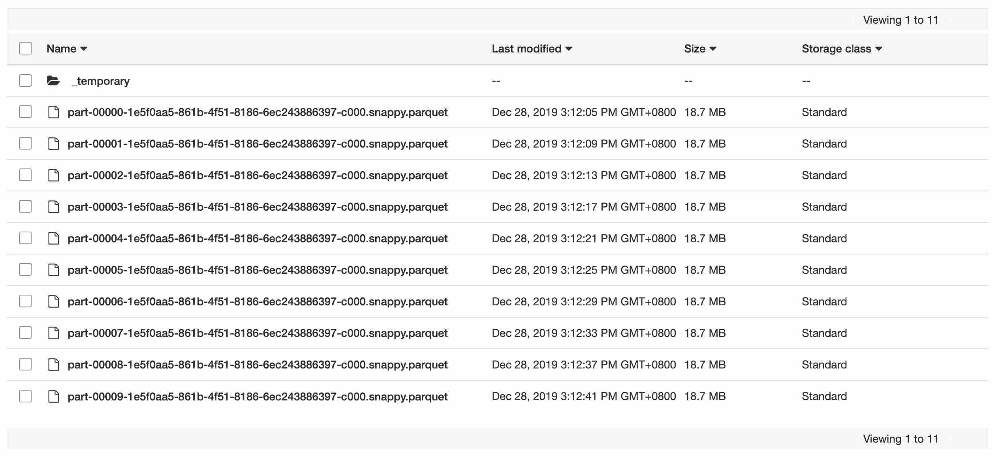

# Data Lake for Liquor Sales in Iowa, US
## Data Engineering Capstone Project Summary
This codebase is part of the Udacity Data Engineering Nanodegree Capstone Project. The purpose of this codebase is to create a data lake using a Spark ETL pipeline to transform staging tables into a dimensional model to better perform analytical queries. The staging data as well as transformed data will be housed on an S3 bucket.

## Project Scope
### Purpose
A new fictional liquor vendor in Iowa, The Malt Brothers, would like to find trends related to historical liquor sales in the state and have tasked the analytics team to built a data lake which would allow easy analysis of the raw data they have.

The data lake will be used by the analytics team to better understand, among other things:
* Which liquor items are most popular
* Is liquor sales affected by holidays
* Which county has stores which spend the most on liquor purchases
* Does lower weather temperatures contribute to more liquore sales

Insights gathered will be used to tailor The Malt Brothers' marketing campaigns and positioning for their liquor products.

### Data
The data sources are detailed below. The full raw dataset sits on an S3 bucket.

|                           Data(sample)                   | Format |                               Description | Source                                                                                | Notes                                                                                                           |
|:--------------------------------------------------------:|--------|------------------------------------------:|---------------------------------------------------------------------------------------|-----------------------------------------------------------------------------------------------------------------|
| /data/liquor_sales/Iowa_Liquor_Sales_sample_noheaders.csv| csv    |    liquor sales in Iowa from 2016 onwards | https://data.iowa.gov/Sales-Distribution/Iowa-Liquor-Sales/m3tr-qhgy                  | Removed header from original file                                                                               |
| /data/holidays/usholidays.json                           | json   |                      dates of US holidays | https://www.kaggle.com/gsnehaa21/federal-holidays-usa-19662020/version/1              | Converted csv into json format                                                                                  |
| /data/weather/*.csv                                      | csv    | monthly weather in Iowa from 2016 to 2018 | https://tracking.idph.iowa.gov/Environment/Climate/Temperature-and-Precipitation-Data | Converted utf-16 format into csv format. Also generated fictional data for year 2019 as it is not available yet |

### Choice of Tools and Technologies
The following tools/technologies have been chosen for developing the data lake ETL:

1. Spark
The size of airbnb's data is growing every day. Using Spark to perform the ELT process will allow for:
   * Quicker Data Processing - taking advantage of the parallelism nature of spark
   * In Memory Computation - Spark has DAG execution engine which facilitates in-memory computation and acyclic data flow resulting in high speed
   * Lazy Evalution - efficiently runs transformations that are necessary to obtain results
   * Cost Efficiency - As data size grows, nodes can be easily and cheaply added into the cluster

2. S3
Both the staging data and transformed data will be stored on an S3 bucket. The S3 bucket is cheap, scalable and easy to read data from.

3. Parquet File Formats
Parquet file formats have been chosen as the final transformed output file storage format. It is good for queries which read particular columns from tables since only needed columns are read and IO is minimized. It is also compatible with many programming languages (python, r etc.) which allows the analytics team flexibility when performing queries.

### Schema Design

A STAR schema design has been implemented. This simplifies the queries the analytics team will write through it's denormalised design. It also allows for faster aggregations as relevant information is captured in a denormalised structure.

This data lake consists of staging tables, one fact table and several dimension tables. This design allows for the analytics team to run quick queries on the fact table to understand the historical sales of liquor products in Iowa. It also allows for queries to answer when, where and what type of questions (when were the products sold? which location have the most purchases in? what products are most popular?) using queries that combine the fact table with the dimension tables.

| Type      | Data                            | Description                                               |
|-----------|---------------------------------|-----------------------------------------------------------|
| Staging   | Iowa_Liquor_Sales_noheaders.csv | Details of sales of liquor products to stores in Iowa, US |
| Staging   | usholidays.json                 | All dates during which a US holiday falls on              |
| Staging   | weather/*.csv                   | Monthly average climate temperatures                      |
| Fact      | liquor_sales                    | All liquor sales transactions in Iowa                     |
| Dimension | items                           | Details of liquor items                                   |
| Dimension | vendors                         | Liquor vendor details                                     |
| Dimension | counties                        | All counties in Iowa                                      |
| Dimension | stores                          | All liquor store details in Iowa                          |
| Dimension | time                            | Calendar of dates with breakdowns                         |

**Please refer to the datadictionary.md file for data dictionaries of these tables.**

## ETL Process
This section documents high level steps in the ETL process. For more detailed steps:
* eda_and_processing_steps.ipynb - this was run on sample data. 
* etl.py - this is the actual etl codebase run on the full dataset

### 1. Load from Staging Tables
1. Read in liquor_sales dataset using spark.read.csv and using explicit schema
2. Read in holidays dataset using spark.read.json
3. Read in weather dataset using spark.read.csv

### 2. Data Cleansing
1. Liquor Sales Data: split Store Location into latitude and logitude
2. Liquor Sales Data: fix inconsistent values in categorical name field
3. Liquor Sales Data: convert county into proper case
4. Holidays Data: cast Date field as date format
5. Holidays Data: rename columns to lowercase
6. Weather Data: rename columns to lowercase and replaces spaces with _

### 3. Transformation into Fact and Dimension Tables
1. Process items dimension table
2. Process vendors dimension table
3. Process counties dimension table
4. Process stores dimension table
5. Process time dimension table
6. Process liquor_sales fact table

### 4. Data Quality Checks
1. Perform checks to ensure counts in each dimension and fact table is greater than 1
2. Perform null value count check on fact table's key

### 5. Load into Parquet Files
1. Save items dimension table into Parquet file format
2. Save vendors dimension table into Parquet file format
3. Save counties dimension table into Parquet file format
4. Save stores dimension table into Parquet file format
5. Save time dimension table into Parquet file format
6. Save liquor_sales fact table into Parquet file format

## Sample Queries and Results
The following are sample queries run on the transformed data to answer analytical questions:

## Addressing Other Scenarios

#### How often should the data be updated
The data should ideally be updated on a weekly basis as a consolidation of all sales transactions that have been done during the week. As the analysis is primarily historical analysis, it is not necessary to update it on a real-time/daily basis as it does not support any front end applications.

#### Scenario 1: The data was increased by 100x.
Because the data is processed in Spark, the impact of this increase will be minimal. We can do the following:
* Increase number of spark executors and resources
* Partition the data accordingly for best parallel processing
* As writes onto the S3 bucket takes the most time, it might be best to perform a review of how write time is impacted by the size increase and adjust the pipeline run time accordingly

#### Scenario 2: The data populates a dashboard that must be updated on a daily basis by 7am every day.
We can perform the following to address this scenario:
* Use Airflow as an orchestration layer to run the pipeline at around 6am daily
* Add an email functionality to alert in case pipeline is not completed by 7am

#### Scenario 3: The database needed to be accessed by 100+ people.
Because the data sits in a data lake on an S3 bucket, access for 100+ people will not be an issue. Users may access both the staging and the final outputs of the data as they wish. Read latency will be addressed by AWS on the back-end.

## Using this Pipeline
### Files

| File                           | Description                                                                                                       |
|--------------------------------|-------------------------------------------------------------------------------------------------------------------|
| README.md                      | Read me file documenting the pipeline details                                                                     |
| etl.py                         | Main pipeline file containing full ETL logic                                                                      |
| eda_and_processing_steps.ipynb | Notebook containing exploratory data analysis and for documenting processing steps. Data used are on sample files |
| dl.cfg                         | Configuration file for inputing AWS credentials                                                                   |
| datadictionary.md              | Data dictionaries of all staging, fact and dimension tables                                                       |
| data                           | Folder containing sample data                                                                                     |
| images                         | Folder containing images for README.md file                                                                       |

### Usage
1. Input your AWS aws access and secret keys into dl.cfg file
2. Update staging data locations in etl.py file, if necessary
3. Update etl.py with output data location on S3 e.g "s3a://my-s3-bucketname/" - this will be the location the final transformed files get saved to
4. Run etl.py file on a terminal

### Output
Output files will be stored as parquet files:

